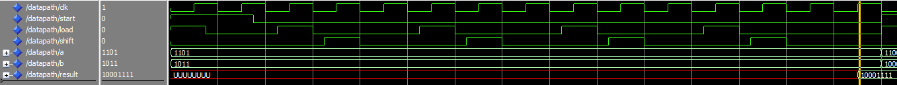
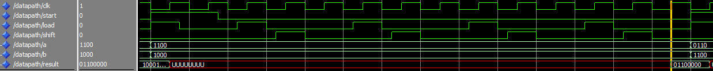
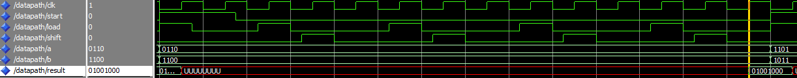

# 4-bit-Multiplier-usinng-ALU-and-Registers
# The 4-bit multiplier uses ALU, registers and counter to perform multiplication between two 4-bit unsigned binary numbers.

The program is compiled in Intel Quartus Prime and run under the testbench to perform the functional computation.
The 4-bit multiplier takes two 4-bit number in binary and multiply the two to produce a result that reflects the computation.
The datapath consists of a 4-bit registers, two 4-bit shifter registers, a 1-bit register, a 4-bit adder, a 4-bit AND gate comparator, and a counter.
  
Assume: a = First multiplication operand, b = Second multiplication operand, E = Ereg, B = Breg, Ph = Phreg, Pl = Plreg
  
The algorithm of the datapath is as below:  
E with '0'  
B = b  
Ph = "0000"  
Pl = a  
counter = 0  
while (counter < 3) {  
(&nbsp) [E, Ph] = Ph + Pl(0)*B  
(&nbsp) LSH1(E, Ph, Pl)  
(&nbsp) counter = counter + 1  
(&nbsp) }  
OUTPUT [Ph, Pl]
 
The timing for the dataflow is controlled by a clock signal and the loading of register is dependent on the rising clock edge.

 

   
  Datapath Design

 

   
  Result computation 1

 
First computation: 
First number  : 1101 (13) 
Second number : 1011 (11) 
Result        : 10001111 (143) 

 

   
  Result computation 2

 
Second computation: 
First number  : 1100 (12) 
Second number : 1000 (8) 
Result        : 01100000 (96) 
 

 

   
  Result computation 3

 
Third computation: 
First number  : 0110 (6) 
Second number : 1100 (12) 
Result        : 01001000 (72) 
 
