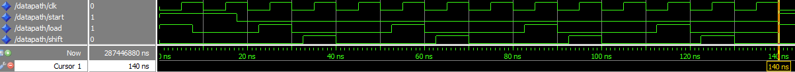
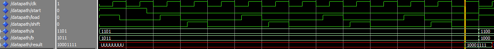
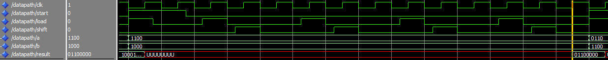
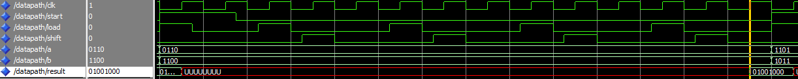

# 4-bit Multiplier using Adder and Registers
# The 4-bit multiplier uses adder, registers and counter to perform multiplication between two 4-bit unsigned binary numbers.

The program is compiled in Intel Quartus Prime and run under the testbench to perform the functional computation.
The 4-bit multiplier takes two 4-bit number in binary and multiply the two to produce a result that reflects the computation.
The datapath consists of a 4-bit registers, two 4-bit shifter registers, a 1-bit register, a 4-bit adder, a 4-bit AND gate comparator, and a counter.
  
Assume: a = First multiplication operand, b = Second multiplication operand, E = Ereg, B = Breg, Ph = Phreg, Pl = Plreg
  
The algorithm of the datapath is as below:  
<pre>
E = '0' 
B = b
Ph = "0000"
Pl = a 
counter = 0 
while (counter < 3) {
    [E, Ph] = Ph + Pl(0)*B 
    LSR1(E, Ph, Pl) 
    counter = counter + 1 
    } 
OUTPUT [Ph, Pl]
</pre>
 

   
  Timing Analysis

 
Figure above shows that the multiplication takes 140ns to complete. 
The clock is set at 5ns for low and high giving a total cycle duty of 10ns. 
The start signal will be high for 17.5ns and low for 122.5ns to enable the loading of value into the registers and allowing the 4-bit adder to compute with the preloaded zero setting. 
The load and shift will follow next where the load will continue to load the adder output into the registers and shift will shift the registers data to the right by one bit. 
For each subsequenct computation, there will be a clock edge before load to allow adder to perform the neccesary computation. 
The last clock edge will be used to indicate the computation has completed and result will be projected. 
 
The timing for the dataflow is controlled by a clock signal and the loading of register is dependent on the rising clock edge.
 
 

   
  Datapath Design

 

   
  Result computation 1

 
First computation: 
First number  : 1101 (13) 
Second number : 1011 (11) 
Result        : 10001111 (143) 

 

   
  Result computation 2

 
Second computation: 
First number  : 1100 (12) 
Second number : 1000 (8) 
Result        : 01100000 (96) 
 

 

   
  Result computation 3

 
Third computation: 
First number  : 0110 (6) 
Second number : 1100 (12) 
Result        : 01001000 (72) 
 
